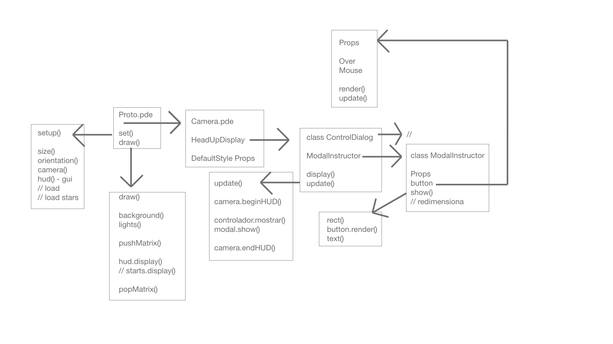

# Prototype_v2

## Diagrama de clases disque

- Utiliza un IDE Processing que se tiene que descargar de la página oficial.
- Es necesario importar una librería peasy para la creación de una cámara virtual desde el IDE.
- Escribir código con el IDE de Processing es un tanto robusto. Incluso algunos atajos con el teclado no funcionan.
- Al final son archivos con extensión .pde de processing development, pero en su interior son clases en java.

## Setup

Existen tres tamaños para el desarrollo y mantenimiento de la app: 1366x768, 1024x640 y fullScreen.

- Se inicializan la cámara, el globo, las estrellas, el hud, la tipografía, los iconos.

## Draw

Aquí se muestran el globo, las estrellas y la hud.

- Funcionalidad de rotar la cámara al tiempo del conteo de frames sobre 2000 ms.
- Las funciones pushMatrix y popMatrix. Son necesarias en esta parte.

## Motivos

- Es mucho más robusto mantener las funciones como hacer click en un botón que con el uso de html js.
- La sintáxis de java es mucho más extensa que la de js.
- Es más fácil encontrar la documentación de las librerías de js que de java.

## Reflexión

- Por estos motivos se intentó sacar el código del IDE y refactorizar la fuente con javascript.
- Para obtener un resultado semejante se intentó con usar p5js, puesto que provienen de una idea similar a processingjs.
- Las pruebas se extendieron hasta revisar la mejor estrategia para importar las librerías, si la intención es subirlo a un repositorio para versionarlo y desplegarlo en el navegador.
- Siendo así que tanto las librerías como p5js, processing como threejs se pueden instalar con un manejador de paquetes.
- Lo siguiente tuvo el atractivo de vue y react al utilizar vite como entorno de ejecución, builder, tester y demás.
- Por estos motivos se descartó utilizar p5js con el cdn en un servidor local que se abre apenas instalando vscode.
